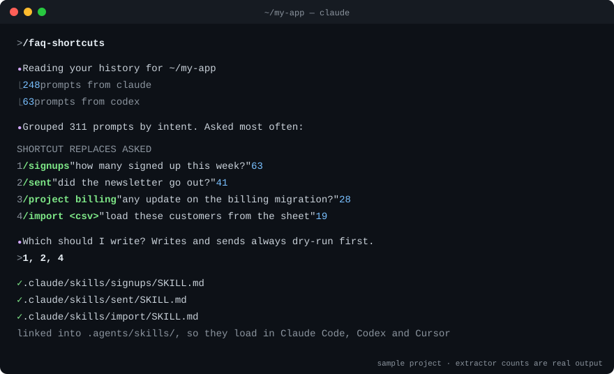

# cli-faq-shortcuts

[](LICENSE)
[](https://github.com/kishormorol/cli-faq-shortcuts/releases)
[](#install)
[](https://github.com/kishormorol/cli-faq-shortcuts/stargazers)

**Stop typing the same long request to your coding agent every day.** This
[Agent Skill](https://agentskills.io) reads your own history, finds the asks you keep
repeating, and turns each one into a short command, like `/sent` or `/project billing`.
It works in Claude Code, Codex and Cursor.



## Quick start

**1. Install** (macOS / Linux, needs `git` and Python 3.9+; on Windows see [Windows](#windows)):

```bash
git clone https://github.com/kishormorol/cli-faq-shortcuts ~/.agents/skills/faq-shortcuts
mkdir -p ~/.claude/skills && ln -sfn ~/.agents/skills/faq-shortcuts ~/.claude/skills/faq-shortcuts
```

**2. Open your project** in Claude Code, Codex or Cursor, in a new session.

**3. Ask** *"what do I keep asking in this project?"*, or type `/faq-shortcuts` in Claude Code.

You'll get a table of your most repeated asks with how often you typed each. Pick the
ones you want and they become shortcuts in that project.

> The repo is `cli-faq-shortcuts`; the skill it installs is called **`faq-shortcuts`**.

**If it saves you typing, please ⭐ star the repo.** Stars are how other people find it.

## Commands

```bash
# inside your project, in Claude Code
/faq-shortcuts                        # find your repeated asks and propose shortcuts
/faq-shortcuts --since 2026-06-01     # only look at recent history
/faq-shortcuts --source codex         # only what you asked Codex

# the extractor on its own: no agent, nothing leaves your machine
E=~/.agents/skills/faq-shortcuts/scripts/extract_asks.py
python3 $E .                          # every prompt you typed here, oldest first
python3 $E . --since 2026-09-01 | wc -l                  # how many since September
python3 $E . | awk -F'\t' 'split($3,w," ")>=4 {print tolower($3)}' \
  | sort | uniq -c | sort -rn | head                     # your most repeated exact requests
```

The last one counts exact repeats only, and it undercounts. On one real project, the most
repeated exact request appeared 4 times. Grouped by intent, however it was worded, the top
ask had been typed **127 times**. That grouping is the agent's job in `/faq-shortcuts`.

## What you get

| You kept typing | You type now |
|---|---|
| "how many people signed up this week, not counting test accounts?" | `/signups` |
| "did the newsletter actually go out? did it reach everyone?" | `/sent` |
| "any update on the billing migration? what's blocked?" | `/project billing` |
| "add this CSV of new customers, skip the ones we already have" | `/import new.csv` |

Each shortcut is a small file in your project, `.claude/skills/<name>/SKILL.md`, for example:

```markdown
---
name: sent
description: Check whether a batch email actually reached people. Use for "did the
  newsletter go out?", "did it reach everyone?", "did X get the email?".
---
# Did it go out

Report only. Never re-send from this shortcut.

## Query
scripts/email-status.js --batch <name>   ← the script your project already has

## Traps
- A "delivered" status to a shared inbox proves nobody read it (happened 3 May).

## Report
Sent / delivered / bounced counts, then the bounced addresses. Then ask.
```

The shortcuts point at the scripts and queries **your** project already uses, and they
record the mistakes already made on that path. So a shortcut is shorter to type and safer
to run. Anything that writes or sends does a dry run first and waits for your yes, so a
typo stops at the preview.

## How it works

1. **Collect.** `scripts/extract_asks.py` prints every prompt you typed in the project,
   from Claude Code and Codex history. It skips subagent turns and scripted runs, because
   you didn't type those.
2. **Cluster.** The agent groups prompts by intent, whatever the wording, and counts them.
3. **Check.** It looks for shortcuts you already have and the tools your project already has.
4. **Propose.** You get a table of shortcut, the ask it replaces, and how often you asked.
   You pick.
5. **Write.** Each chosen shortcut becomes a `SKILL.md` in `.claude/skills/`, linked into
   `.agents/skills/` so all three agents load it, committed so your team gets it too.
6. **List.** A table in `CLAUDE.md` / `AGENTS.md` maps each shortcut to the sentence it replaces.

## Install

The quick start above is the whole install. It puts the skill where each agent looks:

| Agent | Reads skills from |
|---|---|
| Codex | `~/.agents/skills/` |
| Claude Code | `~/.claude/skills/` (the link) |
| Cursor | both |

**Update:** `git -C ~/.agents/skills/faq-shortcuts pull`

**Uninstall:** `rm ~/.claude/skills/faq-shortcuts && rm -rf ~/.agents/skills/faq-shortcuts`

### Windows

In PowerShell, with `git` and Python 3.9+ installed. A directory junction links the skill
into `~/.claude/skills` and, unlike a symlink, needs no admin rights or Developer Mode:

```powershell
git clone https://github.com/kishormorol/cli-faq-shortcuts "$env:USERPROFILE\.agents\skills\faq-shortcuts"
New-Item -ItemType Directory -Force "$env:USERPROFILE\.claude\skills" | Out-Null
New-Item -ItemType Junction -Path "$env:USERPROFILE\.claude\skills\faq-shortcuts" -Target "$env:USERPROFILE\.agents\skills\faq-shortcuts"
```

Run the extractor with `python` (or `py`), not `python3`:

```powershell
python "$env:USERPROFILE\.agents\skills\faq-shortcuts\scripts\extract_asks.py" . | Select-Object -First 10
```

**Update:** `git -C "$env:USERPROFILE\.agents\skills\faq-shortcuts" pull`

**Uninstall:** remove the junction with `rmdir`, which leaves its target alone, then the clone:

```powershell
cmd /c rmdir "$env:USERPROFILE\.claude\skills\faq-shortcuts"
Remove-Item -Recurse -Force "$env:USERPROFILE\.agents\skills\faq-shortcuts"
```

## What it reads

| Agent | History | Read? |
|---|---|---|
| Claude Code | `~/.claude/projects/<project>/*.jsonl` (the last 30 days) and `~/.claude/history.jsonl` (older prompts) | yes |
| Codex | `~/.codex/sessions/` (or `$CODEX_HOME`), matched by the folder each session ran in | yes |
| Cursor | `~/Library/Application Support/Cursor/User/globalStorage/state.vscdb` on macOS; platform-specific Cursor global storage on Windows/Linux | yes |

To see what it finds without the agent:

```bash
python3 ~/.agents/skills/faq-shortcuts/scripts/extract_asks.py ~/my-project | head
```

This prints `date<TAB>source<TAB>prompt`. Add `--source claude`, `--source codex`, or `--source cursor`
to read one tool only, and `--since 2026-01-01` to skip older prompts.

## Troubleshooting

| You see | Do this |
|---|---|
| The agent doesn't know `/faq-shortcuts` | Start a new session. Skills load when a session starts. Check that `ls ~/.claude/skills/faq-shortcuts/SKILL.md` finds the file. |
| `no session history at …` | Run it from the project folder you actually worked in. History is stored per folder, so a subfolder counts as a different project. |
| Very few prompts found | History is read only for the project folder you actually worked in. Cursor conversations are matched by their workspace path. |
| `fatal: destination path … already exists` | It's already installed. Run the update command instead. |

## Contributing

Issues and pull requests are welcome. Good first contributions:

- **[Windows support](https://github.com/kishormorol/cli-faq-shortcuts/issues/1)** without WSL: the install relies on symlinks.
- **A bug report** with the extractor command you ran and what it printed.

Everyone whose pull request is merged appears here:

[](https://github.com/kishormorol/cli-faq-shortcuts/graphs/contributors)

Built with help from [Claude Code](https://claude.com/claude-code).

## Privacy

The extractor only reads local files and makes no network calls. Your prompts can contain
names, emails and tokens, so the skill writes the list to a scratch folder, never into
your repo. Your agent then reads that list the same way it reads any file you show it.

## License

[Apache-2.0](LICENSE).
